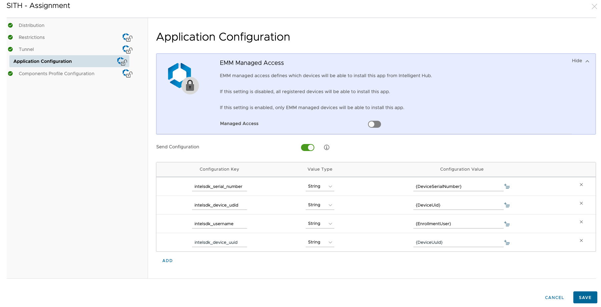

Apps integrating the SDK should set an instance of type `WS1UEMDataDelegate`. (`WS1UEMDataDelegate` must be set before enabling WS1IntelligenceSDK). This provides the following UEM specific attributes serialNumber, deviceUDID, username, and deviceUUID so they can be sent to the Intel backend with the created records. Integration code is shown below -

### WS1UEMDataDelegate

```Swift
@objc public protocol WS1UEMDataDelegate: AnyObject {
    var serialNumber: String? { get }
    var deviceUDID: String? { get }
    var username: String? { get }
    var deviceUUID: String? { get }
}
```

### Sample Implementation

- Objective-C sample implementation for `WS1UEMDataDelegate` methods
```Objective-C
#import "WS1UEMAttributeKeys.h"
#import "WS1Intelligence.h"

@interface AppDelegate () <WS1UEMDataDelegate>
@end

@implementation AppDelegate

- (BOOL)application:(UIApplication *)application didFinishLaunchingWithOptions:(NSDictionary *)
launchOptions {
    WS1Config *config = [WS1Config defaultConfig];
    [WS1Intelligence setUEMProviderDelegate:self];
    [WS1Intelligence enableWithConfig:config];
}

- (NSString *) deviceUDID {
    return [self getAppConfig:[WS1UEMAttributeKeys intelSDKDeviceUDID]];
}
- (NSString *) serialNumber {
    return [self getAppConfig:[WS1UEMAttributeKeys intelSDKSerialNumber]];
}
- (NSString *) username {
    return [self getAppConfig:[WS1UEMAttributeKeys intelSDKSerialNumber]];
}
- (NSString *) deviceUUID {
    return [self getAppConfig:[WS1UEMAttributeKeys intelSDKDeviceUUID]];
}
- (NSString *) getAppConfig: (NSString*) key {
    NSDictionary<NSString*, id> *dictionary = [[NSUserDefaults standardUserDefaults] objectForKey: [WS1UEMAttributeKeys managedAppConfigKey]];
    return [dictionary valueForKey:key];
}
```
- Swift sample implementation for `WS1UEMDataDelegate` functions
```Swift
	import WS1IntelligenceSDK
	
	@objc class IntelligenceSDKUtil: NSObject,WS1UEMDataDelegate {
	
    var serialNumber: String? {
        return self.fetchManagedConfig(key: WS1UEMAttributeKeys.intelSDKSerialNumber())
    }
    var deviceUDID: String? {
        return self.fetchManagedConfig(key: WS1UEMAttributeKeys.intelSDKDeviceUDID())
    }
    var username: String? {
        return self.fetchManagedConfig(key: WS1UEMAttributeKeys.intelSDKUsername())
    }
    var deviceUUID: String? {
        return self.fetchManagedConfig(key: WS1UEMAttributeKeys.intelSDKDeviceUUID())
    }
    private func fetchManagedConfig(key: String) -> String? {
        return self.managedConfig?[key] as? String
    }
```


If the app does not already have access to device-udid, serial-number, username or device-uuid, and if it is managed, then they can be fetched from UEM to be injected into IntelligenceSDK.

Within UEM, the required attributes can be set during app assignment within the ‘Application Configuration’ section as shown in the screenshot.



When an app is pushed with the required attributes, the attributes can be queried and injected into IntelligenceSDK as shown in the code.